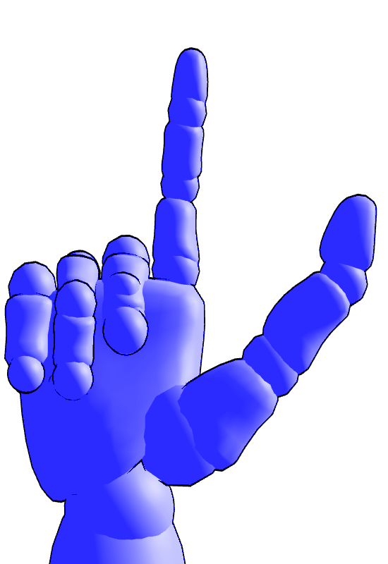
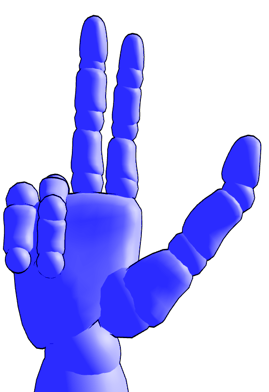
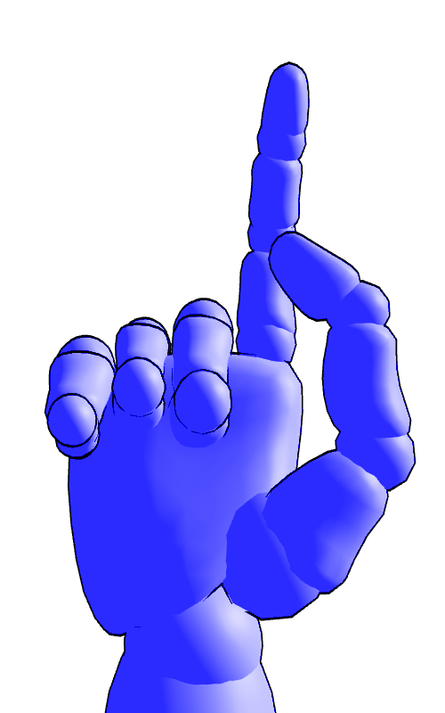
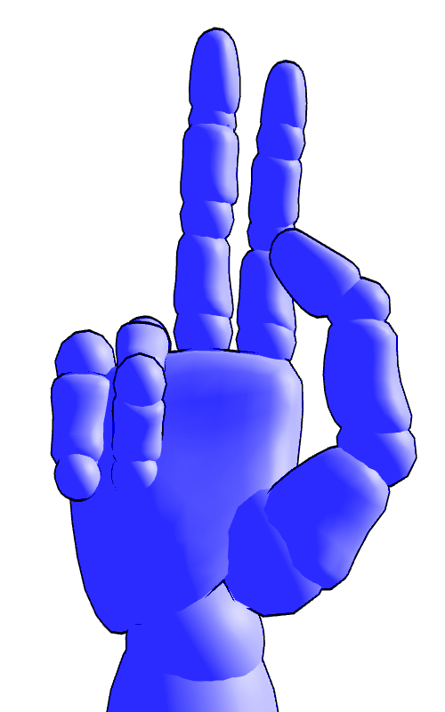
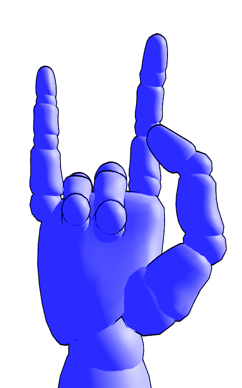
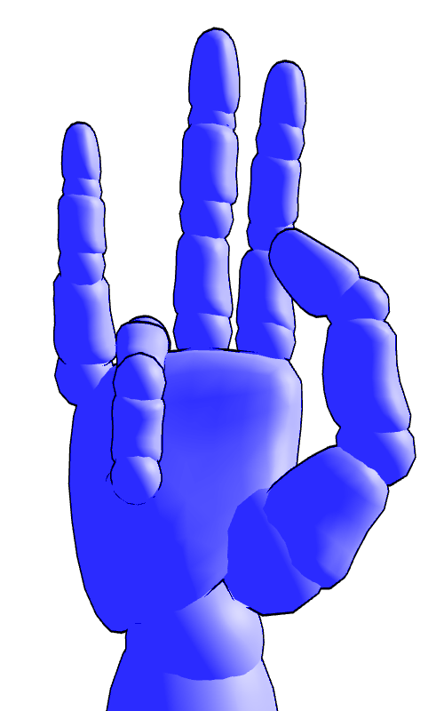
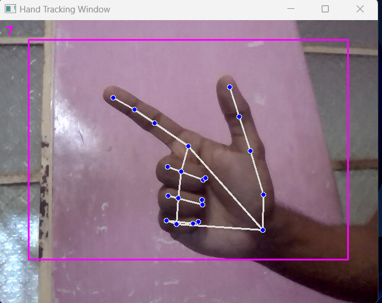
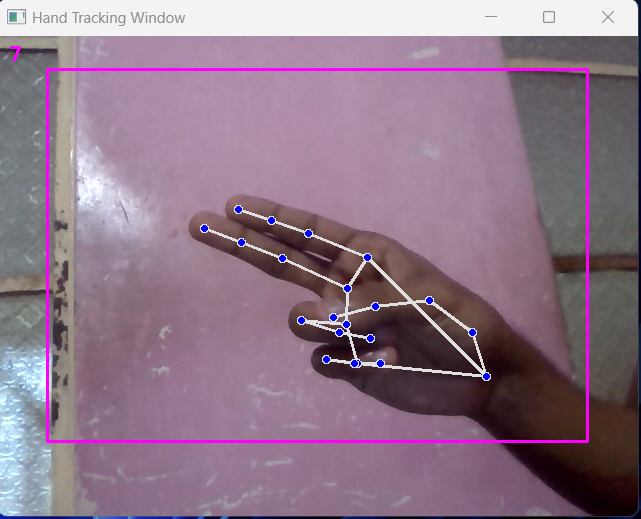
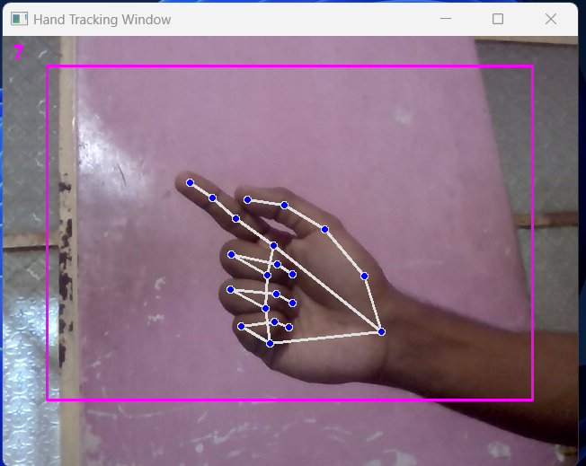
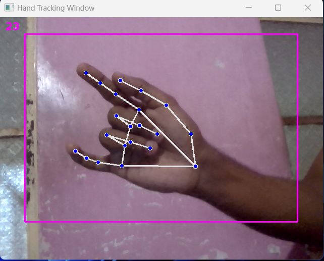

# Gesture Controlled Virtual Mouse

`utility` `computer-vision` `project`

&copy; AnimaxNeil  
|
[website](https://www.animaxneil.com)
|
[email](mailto:animaxneil@gmail.com)
|

---

## Objective

The primary objective of this project is to create a gesture-controlled virtual mouse that enhances accessibility and user experience by providing a hands-free alternative input method. The project aims to empower individuals with mobility challenges and offer a unique and immersive interaction with the computer. It can be very useful during presentations or product demonstration and there is no need to hand the user a hardware device like a mouse to interact with the system.

---

## Features

The project offers an innovative way for users to interact with their computers. Instead of using a physical mouse, the application tracks and recognizes hand gestures in real-time using a webcam to provide the following:

* smooth cursor control

* mouse actions
    * left-click
    * right-click
    * click-and-drag

---

## Functional Overview

* Hand Tracking Algorithm

    > The hand tracking algorithm utilizes Mediapipe's hand tracking module, which relies on machine learning models to accurately detect and track the user's hand landmarks. The detected landmarks serve as input for cursor control and gesture recognition.

* Cursor Control Algorithm

    > The cursor control algorithm uses interpolation and scaling techniques to map hand landmarks to the screen's resolution using NumPy, ensuring smooth and responsive cursor movements. It uses PyAutoGUI to execute the UI input instructions.

* Gesture Recognition Techniques

    > Gesture recognition relies on template matching, where predefined gesture templates are compared with the user's hand landmarks to recognize specific gestures. Additionally, an interval based trigger approach is used to detect click and drag actions based on hand movement over time.

* Video Capture Algorithm

    > Video is captured through the computer’s webcam using tools from OpenCV. It is also used to draw on the captured image to show points of useful indicators like points of interest, trackpad area and fps.

---

## Project Architecture

* main.py

    > The main script to run the application and manage the user interface.

* VirtualMouseModule.py

    > Recognizes gestures for click and drag functionalities and calls the other modules accordingly.

* HandsDetectionModule.py

    > Contains functions for hand tracking using Mediapipe.

* VideocaptureModule.py

    > Contains functions for accessing the webcam using OpenCV.

* IOModule.py

    > Basic input output functions for debugging purposes.

* UIControlModule.py

    > Control cursor, and other inputs like left click, right click, drag and drop, using PyAutoGUI.

---

## Installation

1. Ensure that Python 3.x is installed on the system.

3. Navigate to the project directory.

2. Open a terminal or command prompt.

3. Install the required packages using the following command.
    ``` bash
    pip install mediapipe opencv-python numpy pyautogui
    ```

---

## User Manual

* Running the Application

    1. Ensure your webcam is connected and functioning correctly.
    2. Navigate to the project directory.
    3. Open a terminal or command prompt.
    4. Run the application by executing the following command.
        ``` bash
        python main.py
        ```

* Using Gesture Commands

    1. Place your hand within the webcam's view for hand tracking to begin.
    2. Move your hand, keeping your index finger inside the virtual tracking pad area marked on the screen keeping the specified gesture, to control the cursor on the screen.
    3. Perform specified hand gestures to trigger mouse actions.

* Recognised Gestures

    <table>
    <tr><th colspan=2>Move cursor</th></tr>
    <tr><td>Gesture 1</td><td>Gesture 2</td></tr>
    <tr>
    <td></td>
    <td></td>
    </tr>
    <tr><th colspan=2>Left-click</th></tr>
    <tr><td>Gesture 1</td><td>Gesture 2</td></tr>
    <tr>
    <td></td>
    <td></td>
    </tr>
    <tr><th colspan=2>Right-click</th></tr>
    <tr><td>Gesture 1</td><td>Gesture 2</td></tr>
    <tr>
    <td></td>
    <td></td>
    </tr>
    <tr><th colspan=2>Click-and-drag</th></tr>
    <tr><td colspan=2><ol>
    <li>Perform the left click gesture for more than 2 seconds to initiate click and drag.</li>
    <li>Move cursor to drag the selection.
    <li>Perform the left click gesture again to release.</li>
    </ol></td></tr>
    </table>

---

## Screenshots









---

## Details

* Released on *5 May 2025*

* Dependencies

    * Python 3
    * pip packages
        * mediapipe
        * opencv-python
        * numpy
        * pyautogui

---

## Contact

* Link: https://www.animaxneil.com/contact
* Email: animaxneil@gmail.com

---
